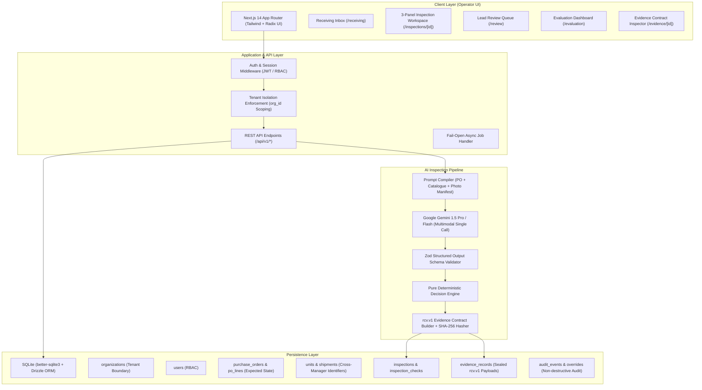
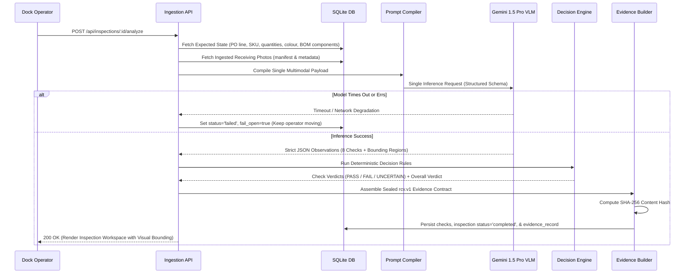

# DockProof — Production Architecture Specification

> **CUBE Buildathon · Round 2 · Track 01: Receiving Manager (RCV)**  
> Technical Design & Architecture Documentation

---

## 1. System Topology & Architecture Overview

DockProof is architected as an evidence-first, multi-tenant receiving inspection platform designed to bridge warehouse physical reality with deterministic commerce business rules.



---

## 2. The Single-Call Multimodal Inspection Pipeline

Per CUBE Buildathon non-negotiable rules, DockProof executes **exactly ONE multimodal inference call per unit**. All visual checks are evaluated simultaneously to minimize network round-trips, maintain operational throughput, and prevent divergent prompt hallucinations.



---

## 3. Deterministic Decision Engine Specification

DockProof enforces strict separation of concerns:
- **The Model Observes:** Extracts visible OCR text, describes package deformation, identifies empty cavities, and flags visual occlusion.
- **The Application Decides:** Pure mathematical and logical business rules evaluate observations against purchase order contractual requirements.

### Decision Rule Formalization:

```
OVERALL VERDICT:
  IF inspection.status != 'completed':
      overall = PENDING
  ELSE IF ANY check.verdict == FAIL:
      overall = EXCEPTION      // Zero Masked Failures
  ELSE IF ANY check.verdict == UNCERTAIN:
      overall = UNCERTAIN      // Conservative Abstention
  ELSE:
      overall = PASS
```

### Specific Check Invariants:

1. **Quantity Reconciliation:**
   $$\Delta_{qty} = \text{Observed Quantity} - \text{Expected Quantity}$$
   - If $\Delta_{qty} = 0 \implies \text{PASS}$
   - If $\Delta_{qty} \neq 0 \text{ and } \text{Occluded} = \text{false} \implies \text{FAIL (Shortage or Overage)}$
   - If $\Delta_{qty} < 0 \text{ and } \text{Occluded} = \text{true} \implies \text{UNCERTAIN}$
2. **Defect Severity Invariant:**
   - Any visible carton crushing, tearing, or water damage immediately fails `carton_damage`, guaranteeing an overall `EXCEPTION`.
3. **Component Visibility Rule:**
   - A missing component claim requires photographic evidence of an empty cavity. If packaging is sealed and internal components are hidden, the check returns `UNCERTAIN` rather than guessing.

---

## 4. Fixed Evidence Contract (`rcv.v1`)

DockProof emits an immutable, versioned evidence contract designed for downstream consumption by Round 3 Pod managers (Prep, Pack, Returns, Recovery):

```json
{
  "record_id": "RCV-0042",
  "schema_version": "rcv.v1",
  "organization_id": "org_demo_alpha",
  "agent": {
    "name": "DockProof",
    "version": "1.0.0"
  },
  "subject": {
    "unit_id": "UNIT-0042",
    "sku": "SKU-LAMP-LED"
  },
  "captured_at": "2026-09-25T10:15:00.000Z",
  "operator_label": "op_amira",
  "images": [
    {
      "id": "img_01",
      "sha256": "sha256:d41d8cd98f00b204e9800998ecf8427e",
      "role": "carton_front"
    }
  ],
  "checks": [
    {
      "check_key": "identity",
      "verdict": "pass",
      "confidence": 0.98,
      "detail": { "sku": "SKU-LAMP-LED", "match": true },
      "model_version": "dockproof-vlm-v1",
      "latency_ms": 840
    },
    {
      "check_key": "carton_damage",
      "verdict": "fail",
      "confidence": 0.94,
      "detail": { "damage_type": "crushed", "severity": "major" },
      "model_version": "dockproof-vlm-v1",
      "latency_ms": 420
    }
  ],
  "outcome": {
    "decision": "exception",
    "decided_by": "system",
    "decided_at": "2026-09-25T10:15:02.000Z"
  },
  "overrides": [],
  "status": "completed",
  "content_hash": "sha256:8b1a9953c4611296a827abf8c47804d7e6c49c6b8c8d8e8f8a8b8c8d8e8f8a8b"
}
```

### Cryptographic Hashing Protocol:
The `content_hash` is computed over the normalized JSON payload (excluding the `content_hash` key itself) via SHA-256. Any modification to verdicts, timestamps, or subject data alters the hash, providing verifiable tamper-evidence.

---

## 5. Security & Multi-Tenant Isolation Model

1. **Session-Derived Tenant Context:** Tenant identifier (`orgId`) is cryptographically signed into JWT session cookies. The API layer derives `orgId` strictly from the verified session, never from client-controlled request bodies or URL path parameters.
2. **Database Scoping Invariant:** Every SQL query explicitly scopes by `WHERE org_id = session.orgId`.
3. **Multi-Tenant Test Verification:** As verified in `tests/integration/tenant-isolation.test.ts`, users authenticated under `org_demo_alpha` cannot query shipments, POs, or photos belonging to `org_demo_bravo`.
4. **Non-Destructive Human Overrides:** Human lead overrides do not overwrite history; they append an audit row to the `overrides` table, recording the actor, original AI verdict, new human verdict, and mandatory justification.

---

## 6. Fail-Open Reliability Architecture

Warehouse inbound docks cannot tolerate blockages caused by cloud AI service outages:
- **30-Second Timeout Budget:** If the VLM call exceeds 30 seconds, the inspection is flagged with `status='failed'`, `fail_open=true`.
- **Receipt Persistence Guarantee:** Physical pallet and carton intake records are persisted regardless of whether AI inspection succeeded.
- **Asynchronous Retry:** Inbound units with `fail_open=true` can be re-analyzed in the background or routed directly to the Lead Review Queue (`/review`).

---

## 7. Key Engineering Decisions & Trade-Offs

| Decision | Alternative Considered | Rationale |
|---|---|---|
| **Unified Next.js 14 Fullstack App** | Separate FastAPI backend + Next.js frontend | Eliminates dual-process orchestration overhead during hackathon evaluation; provides zero-latency SSR and unified TypeScript types between DB, API, and UI. |
| **SQLite with Drizzle ORM** | PostgreSQL with Supabase RLS | Zero external infrastructure dependency; instant local seeding from `receiving_sample.csv`; reproducible anywhere without external network credentials. |
| **Single Batched Multimodal Call** | Multiple sequential tool calls (OCR, then defect, then count) | Eliminates latency multiplication ($8 \times \sim 1.5\text{s} = 12\text{s}$ down to $\sim 1\text{s}$); enforces global context across all 8 checks simultaneously. |
| **Deterministic Business Engine** | Letting LLM generate overall PASS/FAIL in prompt | Prevents prompt drift, hallucinatory tolerances, and masked failures. Rules are 100% unit-tested and auditable. |
