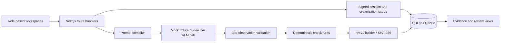

# DockProof architecture

DockProof is a Next.js 14 and TypeScript application for receiving decisions at the warehouse dock. React pages and route handlers share one codebase; SQLite with Drizzle ORM stores purchase orders, units, inspections, check results, and sealed evidence.

## System architecture

The model describes what it observes. It does not own the commercial verdict. The rules engine calculates check results and applies one precedence rule: any fail → `EXCEPTION`; otherwise any uncertain → `UNCERTAIN`; otherwise `PASS`.

## Components

| Component | Code | Responsibility |
| --- | --- | --- |
| Role workspaces | `src/app/(dashboard)/` | Receiving, shipments, inspection detail, review, evidence, evaluation, catalogue, settings |
| Authentication | `src/lib/auth.ts`, `src/middleware.ts`, `src/app/api/auth/` | Password verification, signed session cookie, route authentication |
| Receiving APIs | `src/app/api/inspections/`, `src/app/api/shipments/` | Read and update organization scoped operational records |
| Observation adapter | `src/lib/agents/vlm-client.ts` | Select mock, Gemini, or OpenRouter; make one structured live request |
| Prompt and schema | `src/lib/agents/prompt-compiler.ts`, `observation-schema.ts` | Supply PO expectations; validate structured model output |
| Decision policy | `src/lib/rules/decision-engine.ts` | Compute check verdicts and overall result |
| Evidence | `src/lib/evidence/` | Build `rcv.v1` payload and SHA-256 content hash |
| Persistence | `src/db/index.ts`, `schema.ts` | Local SQLite schema and Drizzle queries; Vercel cold starts copy a bundled demo snapshot to writable `/tmp` |
| Benchmark | `scripts/run-evaluation.ts`, `data/eval/` | Held-out fixture cases and report consumed by Quality lab |

## Data flow

1. An authenticated user selects an inspection. The server checks its organization ID before returning the inspection, unit, PO line, catalogue product, checks, photos, and evidence.
2. Running analysis loads expected SKU, quantity, carton count, units per carton, colour, variant, and BOM components. The prompt compiler prepares a single observation request covering eight gates.
3. In live mode, the adapter sends one multimodal request to the configured Gemini or OpenRouter model. In mock mode, it returns stable offline fixture observations. The schema checks the response structure.
4. The rules engine derives identity, quantity, cartons, units per carton, variant, carton damage, unit damage, and component results. `EXCEPTION` has priority over `UNCERTAIN`; no failed check may be masked by a passing one.
5. The server stores the checks and overall verdict, then builds a `rcv.v1` payload from the inspection, subject, image hashes, check details, decision, and any overrides passed to the builder. SHA-256 is computed over the JSON payload without its `content_hash` property.
6. The evidence vault serves the stored JSON. The review API appends a reasoned override and an audit event; it does not erase the original system decision from the override row.

### Failure path

If live inference times out, returns invalid JSON, lacks required observations, or has no configured key, the analysis route marks the inspection `failed` with `fail_open=true` and clears the current commercial verdict. The physical receipt remains in the database for follow-up. The server does not turn a live failure into a mock PASS. The UI shows these as pending or failed work rather than accepted stock.

## Model and agent usage

- `VLM_MODE=mock` is the default and requires no network key. It produces repeatable fixture observations keyed to a unit, for UI and flow demonstration. It does not inspect image pixels.
- `VLM_MODE=live` uses `VLM_PROVIDER=gemini` with `GEMINI_API_KEY`, or `openrouter` with `OPENROUTER_API_KEY`. Provider model names are configured through `GEMINI_MODEL` and `OPENROUTER_MODEL`.
- Each live analysis is one multimodal call containing all available photos and the expected PO and catalogue state. The model is instructed to abstain when evidence is not visible.
- The application validates JSON observations before applying deterministic rules. The benchmark report under `data/eval/report.json` measures its fixture suite and must not be presented as a field accuracy guarantee.

## Important engineering decisions

| Decision | Reason and tradeoff |
| --- | --- |
| One Next.js application | Keeps UI, API, and data types together for a reproducible demo; the server must run where SQLite and local files are available. |
| SQLite and Drizzle | Local setup needs no external database. The hosted demo starts from a bundled read-only snapshot copied to ephemeral `/tmp`; production multi-instance hosting would need shared storage and stronger migration operations. |
| Signed organization session plus query scoping | The organization is derived from the verified cookie and applied to top level queries. The integration test exercises tenant isolation. |
| Deterministic verdict precedence | Prevents a model narrative or strong pass on one check from masking a confirmed defect elsewhere. |
| Explicit uncertainty and fail-open receipt | A blocked view or model failure must not become a commercial PASS. The dock can preserve the arrival record while review remains open. |
| SHA-256 evidence seal | A stored payload can be checked for changes; the seal is tamper evident, not a replacement for secure storage or a digital signature. |
| Append-only override audit row | A reviewer must give a reason, and the original and new verdict are recorded. The current implementation does not re-seal the stored evidence JSON after an override; the override row and audit event are the authoritative later action. |

## Access and boundaries

The seeded roles are operator, reviewer, administrator, and evaluator. Operators run intake. Reviewers and administrators may submit a binding override. Administrators manage manifests and settings. Evaluators inspect quality reports and cannot call the analyze endpoint. API route handlers verify the session; organization filters apply to the main inspection and shipment records. The local demo uses a single process and local SQLite file at `data/dockproof.db`. On Vercel, `data/dockproof.seed.db` is copied to a commit-scoped database in `/tmp` on cold start so the read-only application bundle remains untouched. This keeps the public demo functional but does not provide durable writes.

The schema and evidence protocol are in [`src/db/schema.ts`](src/db/schema.ts) and [`submissions/chapalaumesh209/contract/rcv.v1.json`](submissions/chapalaumesh209/contract/rcv.v1.json). See [`docs/MODEL_CARD.md`](docs/MODEL_CARD.md) for model assumptions and limitations.
